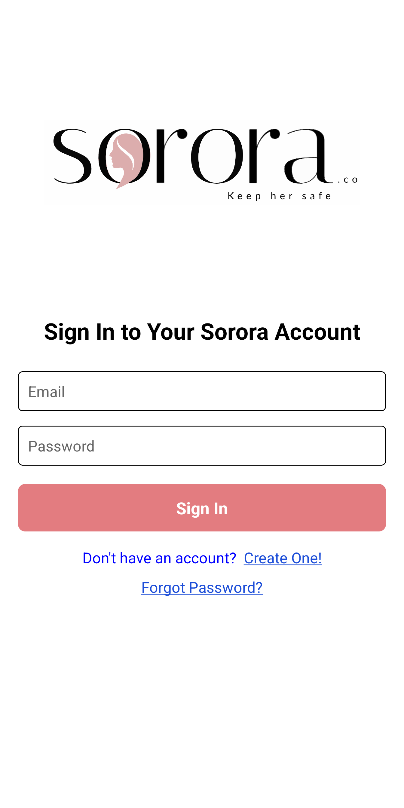
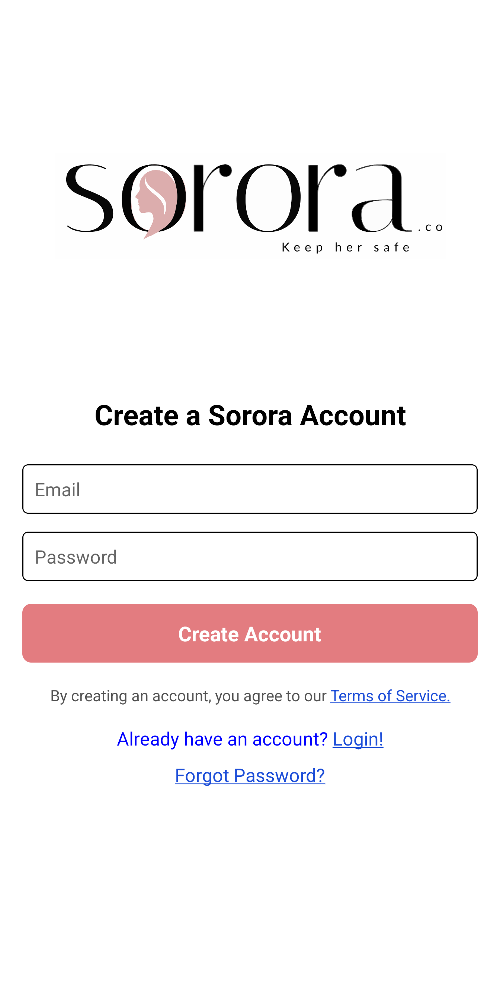
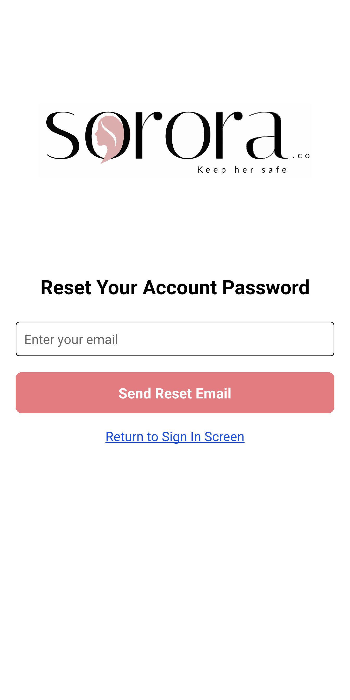
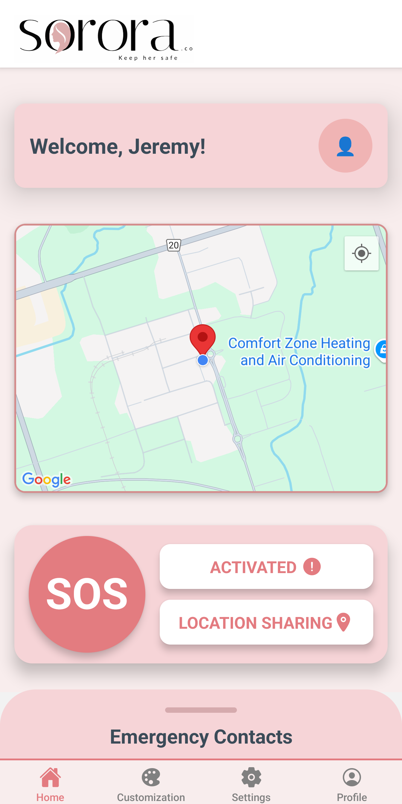
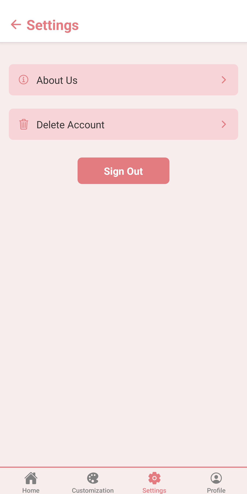
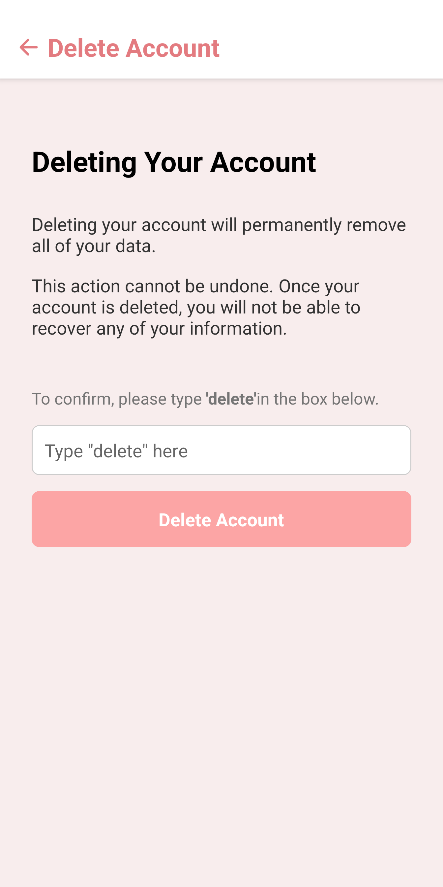
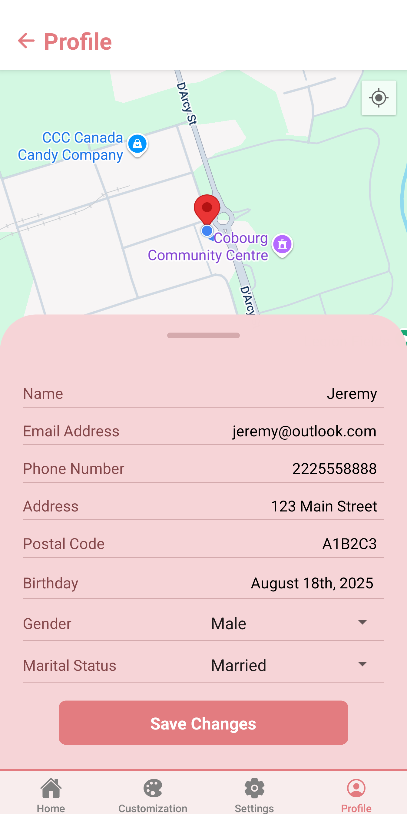

# Sorora.co 

> A mobile app designed to enhance personal safety through real-time alerts, emergency contact integration, and accessibility-first design.  

---

## 📱 Overview  
**Sorora.co (formerly Keep Her Safe)** is a mobile application that empowers individuals to act quickly in unsafe situations. With features like an SOS button, emergency contact alerts, and accessibility customization, it focuses on **safety, speed, and ease of use**.  

This repo is a **public showcase** of the project — the full source code is kept private for security reasons.  

---

## ✨ Key Features  
- **SOS Button** – instantly alert trusted contacts with your location.  
- **Emergency Contacts** – add, edit, and organize multiple emergency numbers.  
- **Custom Alerts** – personalize the message that gets sent out.  

---

## 🛠️ Tech Stack  

### Frontend
- **React Native (Expo)** – Cross-platform mobile app development  
- **State Management** – React Context & Hooks for managing app state  

### Backend
- **Firebase** – Authentication, Firestore database, Cloud Functions for server-side logic  

### Libraries & APIs
- **Navigation & UI**: Expo Router, @gorhom/bottom-sheet  
- **Device APIs**: Location & SMS integration for SOS functionality  
- **Accessibility**: Built-in React Native accessibility features  

### Testing & Quality
- **Unit & Integration Testing**: Jest, React Native Testing Library  

### Deployment & CI
- **Expo Publish / EAS Build** – App deployment and build automation  

### Design & Prototyping
- **Figma & Canva** – UI/UX design and mockups  

### Version Control & Collaboration
- **GitHub** – Private development repository  

### Other Tools
- **VS Code** – Code editor  
- **Postman** – API testing and debugging  

---

## 🏗️ System Design  

- **Architecture** – [See architecture.md](./docs/architecture.md) – Client app connected to Firebase backend.  
- **Database** – [See database-schema.md](./docs/database-schema.md) – Firestore used for storing user profiles, emergency contacts, and settings.  
- **User Flows** – [See user-flows.md](./docs/user-flows.md) – Detailed flow and step-by-step user interactions.
- **API Design** – [See api-design.md](./docs/api-design.md) – Overview of endpoints, Firestore operations, and device API usage. 
 

---

## 🚀 Initial Development Kickoff
- [x] User authentication (signup, login, forgot password)  
- [x] Live location tracking map  
- [x] SOS button with SMS integration  
- [x] Emergency contacts management (add, edit, remove)  
- [x] Custom alert message creation  
- [x] Settings screen (About Us, Delete Account)  
- [x] Profile management (update name, email, phone with validation, etc)  
- [x] Real-time Firestore updates for contacts and settings  
- [x] Modular and scalable architecture ready for additional features  

---

## 👩‍💻 My Role  
I serve as the **sole developer** on this project, leading:  
- Mobile app development (React Native).  
- Backend setup (Firebase).  
- Feature implementation from mockups to production.  
- UI/UX design alongside the project team.  
- Technical documentation & accessibility compliance.  

---

## 📂 This Repo Contains  
- 📖 Project documentation (`/docs`).  
- 🎨 Screenshots & mockups.
- ❌ **Note:** Full source code is private for security reasons.  

---

## 🎥 Demo & Screenshots  

Below are grouped screenshots from the **Sorora.co** app.  

---

### 🔑 Authentication  
Core authentication screens that let users securely create an account, log in, or recover their password.  

  
  
  

  

---

### 🏠 Home  
The main landing page with quick access to the SOS button and an overview of saved emergency contacts.  

  
  
  

  

---

### 🎨 Customization  
Settings that allow users to manage their emergency contacts and personalize their alert.

  
  
  

  

  
  

  

---

### ⚙️ Settings  
General account and app settings including about the creators, delete account options, and sign out.  

  
  
  

  

---

### 👤 Profile  
A dedicated screen for viewing and managing the user’s account profile information.  

  

  

---

## 🙌 Acknowledgments  
This project is being developed as part of a youth-led initiative with a 5-member team, combining design, research, and development to improve personal safety.  

---

## 📬 Contact  
If you’d like to learn more or collaborate, reach out:  
**Jeremy Mohammed** – [LinkedIn](https://www.linkedin.com/in/jeremy-mohammed/) | [Email](mailto:jeremy_mohammed@outlook.com)  
